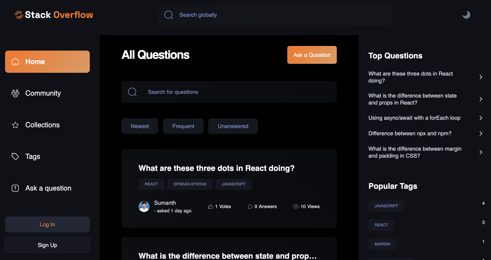

# Stack Overflow Clone

Welcome to the Stack Overflow Clone, a sophisticated full-stack web application meticulously crafted with cutting-edge technologies. This project, developed using Next.js 14, TypeScript, Tailwind CSS, MongoDB, and the Clerk authentication system, faithfully replicates the feature-rich functionality of Stack Overflow. Users can seamlessly post questions, contribute answers, and partake in a collaborative knowledge-sharing platform.

[](https://stack-overflow-jet.vercel.app/)

## Features

### Authentication
- Seamlessly integrated user authentication using Clerk ensures a secure and user-friendly login experience.

### Themes
- Enjoy a personalized browsing experience with light, dark, and system theme options.

### Tags
- Efficiently categorize questions with tags for enhanced organization and search functionality.

### Community Page
- Discover and connect with fellow users on a dedicated community page.

### Collections
- Bookmark your favorite questions for quick access through the collections feature.

### Question and Answer Management
- Empower users to maintain the quality of their contributions by providing the ability to delete and edit their questions and answers.

### Profile Page
- Personalized user profiles showcase earned badges, contributed questions, and answers.

### Badges
- Earn recognition through badges based on contributions and achievements within the community.

### Local and Global Search
- Utilize the local search feature for efficient filtering within pages, and leverage global search to explore questions, tags, users, and more.

### Responsive Design
- The entire website is meticulously designed with responsiveness in mind, ensuring a seamless experience across devices.

## Tech Stack

- **Frontend:**
  - Next.js 14 with App Router 
  - TypeScript
  - Tailwind CSS
  - Shadcn UI Component Library

- **Backend:**
  - MongoDB
  - Mongoose ORM
  - Next.js API Routes
  - server actions
  - webhooks

- **Authentication:**
  - Clerk Authentication System

## Deployment

The application is deployed on Vercel, offering a reliable and scalable hosting solution.

## Explore the Project

- **Live Demo:** [Stack Overflow Clone](https://stack-overflow-jet.vercel.app/)
- **GitHub Repository:** [Stack Overflow Clone Repository](https://github.com/sumanth-botlagunta/stack_overflow_next13)

## Getting Started

Follow these steps to set up the project locally:

### Prerequisites
  - Node.js (v20.9.0 >=)
  - npm (v10.2.3 >=)
  - git

### Steps

1. Clone the repository locally:
    ```bash
    git clone https://github.com/sumanth-botlagunta/stack_overflow_next13

    cd stack_overflow_next13
    ```

2. Install dependencies:
    ```bash
    npm install
    ```

3. Create a `.env.local` file in the root directory and add the following environment variables:
    ```bash
    NEXT_CLERK_WEEBHOOK_SECRET=<from your clerk nextjs setup>
    NEXT_PUBLIC_CLERK_PUBLISHABLE_KEY=<from your clerk nextjs setup>
    CLERK_SECRET_KEY=<from your clerk nextjs setup>

    NEXT_PUBLIC_CLERK_SIGN_IN_URL=/sign-in
    NEXT_PUBLIC_CLERK_SIGN_UP_URL=/sign-up
    NEXT_PUBLIC_CLERK_AFTER_SIGN_IN_URL=/
    NEXT_PUBLIC_CLERK_AFTER_SIGN_UP_URL=/

    NEXT_PUBLIC_TINY_MCE_API_KEY=<your tiny mce api key to text editor>
    MONGODB_URI=<your mongodb server URI>
    ```

4. Start the development server:
    ```bash
    npm run dev
    ```

## Contributing

Contributions are welcomed! Feel free to open issues, submit pull requests, or provide feedback to enhance the project.

## Acknowledgments

Special thanks to [@javascriptmastery](https://www.youtube.com/@javascriptmastery) for an outstanding tutorial on Next.js app router and server actions. This application was built as part of the learning journey inspired by his teaching style. Check out his [course](https://www.jsmastery.pro/ultimate-next-course) for an in-depth exploration of Next.js.

---

Thank you for exploring the Stack Overflow Clone! We hope you enjoy the collaborative and engaging experience it offers. If you have any questions or suggestions, feel free to reach out. Happy coding! 😊
